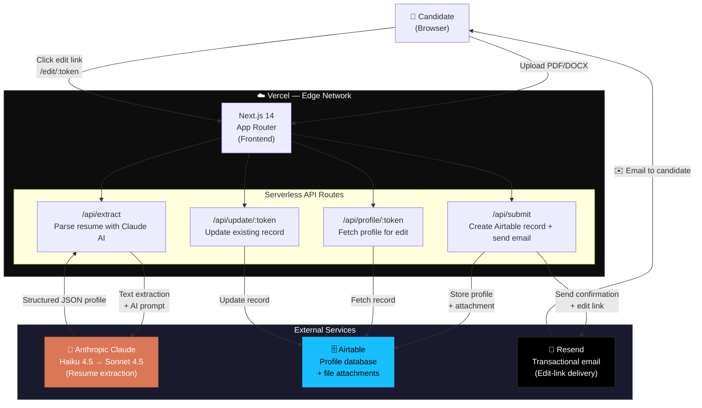
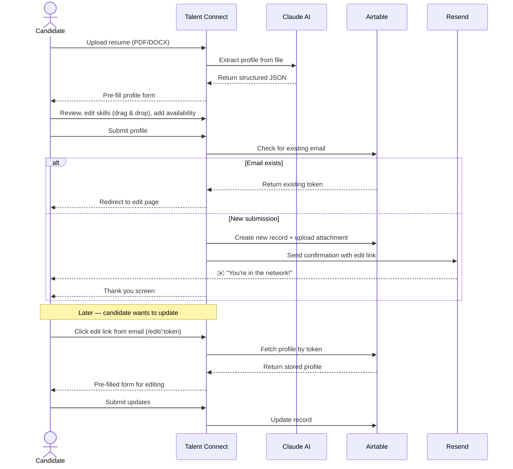

<div align="center">

# 🌐 Talent Connect

**AI-powered part-time consulting talent network**

[](https://talent-connect-virid.vercel.app)
[](https://nextjs.org)
[](https://vercel.com)
[](https://anthropic.com)
[](https://airtable.com)

<br/>

*Upload your resume → AI extracts your profile in seconds → Get matched to projects worldwide*

[**View Live App**](https://talent-connect-virid.vercel.app) · [Report a Bug](https://github.com/poovannanrajendran/talent-connect/issues) · [Request Feature](https://github.com/poovannanrajendran/talent-connect/issues)

<br/>

[](https://talent-connect-virid.vercel.app)

</div>

---

## 📋 Overview

**Talent Connect** is a full-stack web platform that streamlines how part-time consultants join a global talent network. Instead of filling in lengthy forms manually, candidates simply upload their CV — and Claude AI reads it, extracts all relevant information, and pre-fills a structured profile within seconds.

The platform is built for a consulting firm that places part-time talent across **UK, Europe, USA, and Middle East** markets. Consultants can review their AI-extracted profile, drag-and-drop their skills between Core and Secondary categories, add availability, and submit — all in under three minutes.

> **Built by [Poovannan Rajendran](https://github.com/poovannanrajendran)** as a real internal tool, then open-sourced.

---

## ✨ Features

| Feature | Description |
|---|---|
| 🤖 **AI Resume Parsing** | Claude Haiku 4.5 (Sonnet fallback) extracts name, skills, experience, domains, and bio from PDF or Word files |
| 🖱️ **Drag & Drop Skills** | Candidates reorder and move skills between Core and Secondary categories via @dnd-kit |
| 📧 **Edit-by-Email** | Every submission generates a unique link — candidates can update their profile at any time |
| 🔄 **Duplicate Detection** | Re-submitting the same email redirects to the edit flow instead of creating duplicates |
| 📊 **Airtable Backend** | All profiles stored in Airtable — consultants can filter, sort, and search directly in Airtable |
| 📈 **Analytics Built-in** | Vercel Analytics + Speed Insights track usage and performance out of the box |
| 🌍 **Fully Remote Ready** | No location restrictions — built for a globally distributed talent pool |
| 📱 **Responsive Design** | Optimised for desktop and mobile via Tailwind CSS |

---

## 🏗️ Architecture



---

## 🔄 User Flow



---

## 🛠️ Tech Stack

<table>
<tr>
<th>Layer</th>
<th>Technology</th>
<th>Purpose</th>
</tr>
<tr>
<td><strong>Frontend</strong></td>
<td>Next.js 14 (App Router) + React 18</td>
<td>Full-stack framework, SSR, API routes</td>
</tr>
<tr>
<td><strong>Styling</strong></td>
<td>Tailwind CSS + @tailwindcss/forms</td>
<td>Responsive, utility-first design</td>
</tr>
<tr>
<td><strong>AI / LLM</strong></td>
<td>Anthropic Claude Haiku 4.5 → Sonnet 4.5</td>
<td>Resume parsing with JSON extraction</td>
</tr>
<tr>
<td><strong>Database</strong></td>
<td>Airtable</td>
<td>Profile storage, file attachments, easy consultant UI</td>
</tr>
<tr>
<td><strong>Email</strong></td>
<td>Resend</td>
<td>Transactional emails with unique edit links</td>
</tr>
<tr>
<td><strong>Drag & Drop</strong></td>
<td>@dnd-kit (core + sortable)</td>
<td>Skills reordering between Core and Secondary</td>
</tr>
<tr>
<td><strong>File Parsing</strong></td>
<td>mammoth (DOCX → text)</td>
<td>Word document content extraction pre-AI</td>
</tr>
<tr>
<td><strong>Hosting</strong></td>
<td>Vercel (free tier)</td>
<td>Serverless deployment, edge network</td>
</tr>
<tr>
<td><strong>Analytics</strong></td>
<td>Vercel Analytics + Speed Insights</td>
<td>Usage tracking + Core Web Vitals</td>
</tr>
</table>

---

## 📁 Project Structure

```
talent-connect/
├── src/
│   ├── app/
│   │   ├── page.js                   # Homepage — hero + multi-step form
│   │   ├── layout.js                 # Root layout (Analytics + SpeedInsights)
│   │   ├── globals.css               # Tailwind base styles
│   │   └── api/
│   │       ├── extract/route.js      # POST — Claude AI resume parsing
│   │       ├── submit/route.js       # POST — Create profile + send email
│   │       ├── profile/[token]/      # GET  — Fetch profile by edit token
│   │       └── update/[token]/       # PUT  — Update profile by edit token
│   │
│   ├── components/
│   │   ├── MultiStepForm.jsx         # Orchestrates all form steps + state
│   │   ├── UploadStep.jsx            # Step 1: File upload drop zone
│   │   ├── ProcessingStep.jsx        # Step 2: "AI is reading your resume..."
│   │   ├── ReviewStep.jsx            # Step 3: Review + edit extracted profile
│   │   ├── SkillsDndSection.jsx      # Drag & drop Core ↔ Secondary skills
│   │   └── ThankYouStep.jsx          # Step 4: Success confirmation
│   │
│   └── lib/
│       ├── claude.js                 # AI extraction logic (Haiku → Sonnet fallback)
│       ├── airtable.js               # Airtable CRUD operations
│       └── email.js                  # Resend email templates + dispatch
│
├── scripts/
│   ├── setup-airtable.js             # One-time Airtable base + table setup
│   └── test-e2e.js                   # End-to-end submission test script
│
├── public/                           # Static assets
├── next.config.mjs                   # Next.js configuration
├── tailwind.config.js                # Tailwind configuration
└── package.json
```

---

## 🚀 Getting Started

### Prerequisites

- Node.js 18+
- An [Airtable](https://airtable.com) account (free)
- An [Anthropic](https://console.anthropic.com) API key
- A [Resend](https://resend.com) account (free tier: 3,000 emails/month)

### 1. Clone the repo

```bash
git clone https://github.com/poovannanrajendran/talent-connect.git
cd talent-connect
npm install
```

### 2. Set up Airtable

Make sure your Airtable personal access token has these scopes:

- `schema.bases:write` · `schema.bases:read`
- `data.records:write` · `data.records:read`
- `data.attachments:write`

Run the setup script to create the base and table automatically:

```bash
AIRTABLE_API_KEY=pat_xxxx node scripts/setup-airtable.js
```

Copy the printed `BASE_ID` — you'll need it in the next step.

### 3. Configure environment variables

Create a `.env.local` file in the project root:

```env
# Anthropic
ANTHROPIC_API_KEY=sk-ant-...

# Airtable
AIRTABLE_API_KEY=pat_...
AIRTABLE_BASE_ID=app...
AIRTABLE_TABLE_NAME=Talent Profiles

# Resend (email)
RESEND_SECRET_KEY=re_...
RESEND_FROM_EMAIL=noreply@yourdomain.com   # Must be a verified Resend domain

# App
NEXT_PUBLIC_APP_URL=http://localhost:3000
```

### 4. Run locally

```bash
npm run dev
```

Open [http://localhost:3000](http://localhost:3000) — you should see the upload screen.

### 5. Run the end-to-end test *(optional)*

```bash
npm test
```

This runs a headless submission flow and checks Airtable + email delivery.

---

## ⚙️ Environment Variables

| Variable | Required | Description |
|---|---|---|
| `ANTHROPIC_API_KEY` | ✅ | Anthropic API key — Claude AI resume parsing |
| `AIRTABLE_API_KEY` | ✅ | Airtable personal access token |
| `AIRTABLE_BASE_ID` | ✅ | Airtable base ID (from setup script) |
| `AIRTABLE_TABLE_NAME` | ✅ | Table name (default: `Talent Profiles`) |
| `RESEND_SECRET_KEY` | ✅ | Resend API key for sending emails |
| `RESEND_FROM_EMAIL` | ✅ | Verified sender address in Resend |
| `NEXT_PUBLIC_APP_URL` | ✅ | Full public URL (used in edit links in emails) |

---

## 🌐 Deploy to Vercel

1. **Push to GitHub** (if not already done)

2. **Import to Vercel**
   - Go to [vercel.com/new](https://vercel.com/new)
   - Select your `talent-connect` repository
   - Framework: **Next.js** (auto-detected)

3. **Add environment variables**
   - In Vercel dashboard → Settings → Environment Variables
   - Add all variables from your `.env.local`
   - Update `NEXT_PUBLIC_APP_URL` to your Vercel deployment URL

4. **Deploy** — Vercel handles the rest ✅

> 💡 **Tip:** Branch protection is enabled on `main`. Always deploy via pull request or Vercel's git integration — never force-push.

---

## 🔗 API Reference

| Method | Endpoint | Description |
|---|---|---|
| `POST` | `/api/extract` | Accepts `multipart/form-data` with `resume` file. Returns extracted JSON profile via Claude AI. |
| `POST` | `/api/submit` | Accepts profile JSON. Creates Airtable record, uploads file attachment, sends confirmation email. Returns `{ token }`. |
| `GET` | `/api/profile/:token` | Returns stored profile for a given edit token. Used to pre-fill the edit form. |
| `PUT` | `/api/update/:token` | Updates an existing Airtable record. Accepts profile JSON. |

---

## 📧 Email & Edit Flow

When a candidate submits their profile, they receive a confirmation email containing a **unique, permanent edit link**:

```
https://your-app.vercel.app/edit/<uuid-token>
```

- The token is generated with `uuid` and stored in Airtable alongside the profile
- Clicking the link loads the `/edit/[token]` page, which pre-fills the form with the stored profile
- Submitting updates the existing Airtable record — no duplicates created
- If someone submits the **same email** on the main form, they are automatically redirected to their edit page

---

## 🤖 AI Extraction Details

The Claude AI integration lives in `src/lib/claude.js` and uses a **waterfall model strategy**:

1. **Haiku 4.5** is tried first — fast and cost-efficient
2. If the extraction fails or returns weak output, **Sonnet 4.5** is used as fallback
3. The extracted JSON includes: `name`, `email`, `phone`, `linkedin`, `currentRole`, `yearsOfExperience`, `location`, `skills`, `domains`, `languages`, and `bio`
4. The first 3 skills automatically become **Core Skills**; the rest go to **Secondary**
5. Supported file formats: **PDF** (direct API upload) and **DOCX** (via `mammoth` → plain text)

---

## 📄 License

This project is **MIT licensed** — free to use, modify, and distribute.

---

<div align="center">

Made with ❤️ by [Poovannan Rajendran](https://github.com/poovannanrajendran)

[](https://github.com/poovannanrajendran/talent-connect)

</div>
